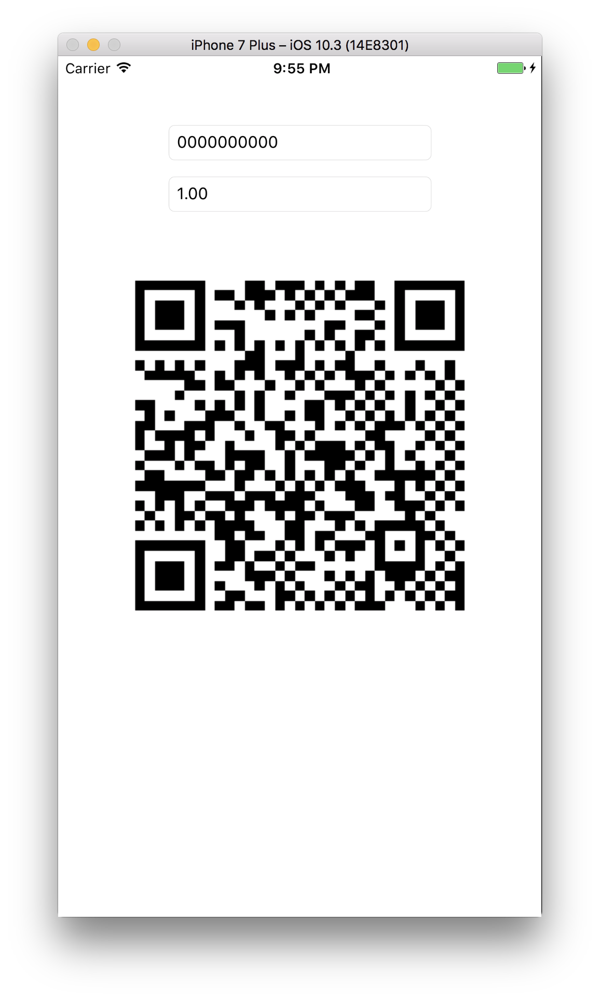

# swift promptpay-qr
Mobile app to generate QR Code payload for PromptPay.

## Example
```
let amount = "54" + String(format: "%02d", (moneyText.characters.count)) + moneyText
let code = "00020101021129370016A000000677010111" + accountId + "5303764" + amount + "5802TH6304"
let chsum = String(format: "%04X", crc16(code)!).uppercased()
```

## Sample Generated PromptPay QR Code
<p align="left">
  
</p>

## References
- https://www.blognone.com/node/95133
- https://github.com/diewland/promptpay-qr-plus
- https://github.com/nitipatl/ios-promptpay-qr-play

## License
The MIT License (MIT)
